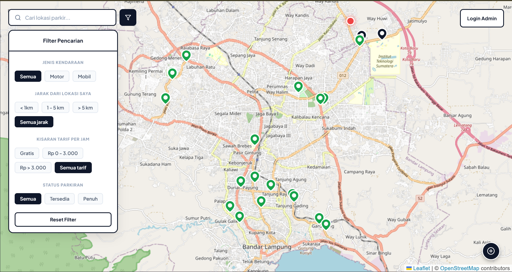
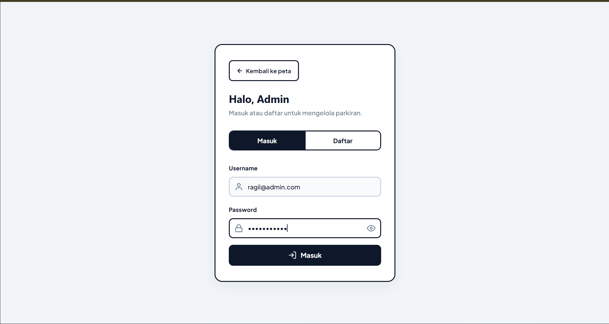
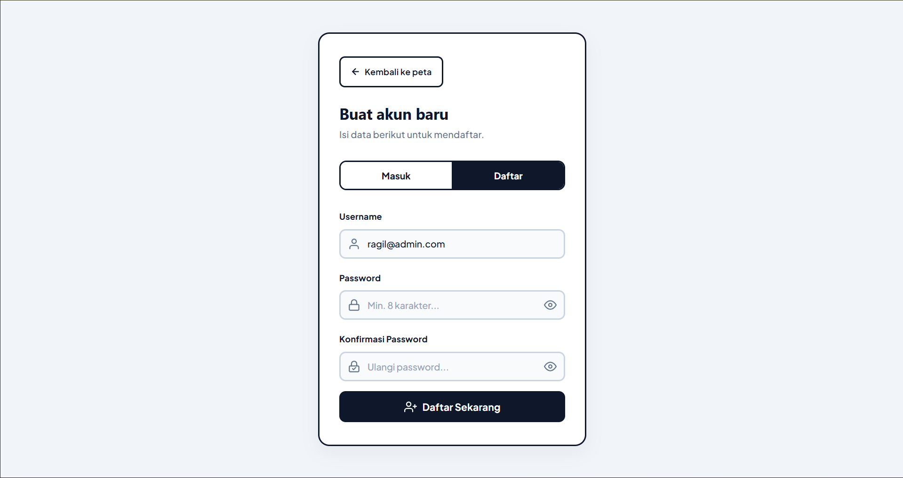
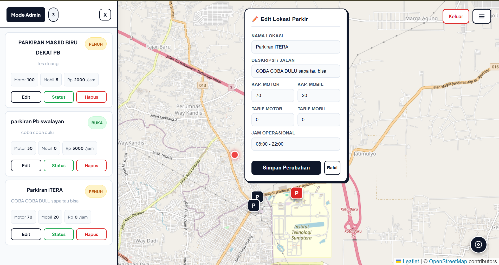

# 🗺️ Aplikasi WebGIS Lahan Parkir Multi-Admin (Bandar Lampung)

Proyek Tugas Besar Sistem Informasi Geografis (SIG) ini merupakan aplikasi manajemen lahan parkir interaktif berbasis web untuk wilayah Bandar Lampung dan sekitarnya. Aplikasi ini dirancang menggunakan arsitektur **Multi-Admin (*Data Ownership*)**, di mana setiap admin yang terautentikasi hanya dapat mengelola (tambah, edit, ubah status, hapus) data lahan parkir milik mereka sendiri tanpa bisa mengganggu atau memodifikasi data milik admin dari kelompok lain.

---

## 👥 Anggota Pengembang (Kelompok)

| Nama | NIM |
|------|-----|
| Jana Rohman Wasiso | 123140046 |
| Cikal Galih Nur Arifin | 123140109 |
| Ragil Bayu Saputra | 123140128 |
| Andre Prasetya Daely | 123140131 |

---

## ✨ Fitur Utama Sistem

1. **Autentikasi & Registrasi Modern:** Sistem login dan daftar admin yang dinamis menggunakan enkripsi keamanan berbasis **Token JWT (*JSON Web Token*)** dengan pembatasan hak akses data kepemilikan.

2. **Kalkulasi Spasial Akurat (`PostGIS`):** Fitur pencarian titik parkir terdekat dari posisi koordinat GPS asli pengguna memanfaatkan fungsi query spasial `ST_Distance` dan `ST_Transform` berbasis koordinat bumi nyata (*WGS 84 / SRID 4326*).

3. **Antarmuka Neobrutalism Clean UI:** Desain visual tegas berkarakter modern (tanpa ikon emoji amatir) dengan tipografi bersih `Plus Jakarta Sans`.

4. **Panel Drawer Manajemen (Sisi Admin):** *Sidebar panel* melayang di sisi kiri peta yang interaktif untuk memudahkan kontrol penuh terhadap seluruh titik parkir terdaftar.

5. **Smart Form Popup:** Deteksi klik peta untuk memunculkan formulir tambah lokasi baru, serta sistem auto-offset kamera peta agar popup tinggi tidak terpotong batas atas layar saat tombol *Edit* ditekan.

6. **Filter Pencarian Reaktif (Sisi User):** Penyaringan data spasial reaktif berdasarkan jenis kendaraan, radius jarak spasial, kisaran tarif per jam, dan status ketersediaan.

---

## 🛠️ Tech Stack yang Digunakan

| Layer | Teknologi |
|-------|-----------|
| **Frontend** | React.js, React Leaflet (Peta Interaktif GIS), Axios (HTTP Client) |
| **Backend** | FastAPI (Python), Uvicorn (ASGI Server), Psycopg2 (Database Driver) |
| **Database** | PostgreSQL + ekstensi **PostGIS** (Objek & Query Spasial) |

---

## 📂 Struktur Direktori Proyek

```text
TUGAS-BESAR-SIG/
├── backend/          # Source code server FastAPI (Python)
├── frontend/         # Source code aplikasi React.js
└── gambar/           # Dokumentasi visual aset antarmuka sistem (.png)
```

---

## 📸 Dokumentasi Antarmuka Sistem (Screenshots)

### 1. Halaman Peta Utama Pengguna (User View)

Halaman pencarian interaktif bagi pengguna umum untuk memantau status parkir secara *real-time*, lengkap dengan filter radius jarak PostGIS dan penanda warna (Green = Tersedia, Black = Penuh).



---

### 2. Halaman Autentikasi Masuk Admin (Login Page)

Halaman gerbang masuk petugas admin menggunakan verifikasi token JWT untuk masuk ke panel spasial khusus.



---

### 3. Halaman Registrasi Admin Baru (Register Page)

Sistem pendaftaran admin baru dengan fitur validasi reaktif pencocokan kecocokan baris password.



---

### 4. Panel Kendali Utama Admin (Dashboard Admin View)

Dashboard fungsional penuh bagi admin untuk mengubah status ketersediaan lahan secara instan, melakukan edit parameter data via query `PUT`, serta menghapus koordinat spasial PostGIS secara permanen.



---

## 🚀 Panduan Instalasi Lokal (Local Deployment)

### Sisi Backend (FastAPI)

**1. Masuk ke direktori backend:**
```bash
cd backend
```

**2. Pastikan database PostgreSQL & PostGIS sudah menyala, lalu buat virtual environment Python:**
```bash
python -m venv venv
source venv/bin/activate   # Untuk Windows: venv\Scripts\activate
```

**3. Install dependensi:**
```bash
pip install -r requirements.txt
```

**4. Jalankan server backend:**
```bash
uvicorn main:app --reload
```

---

### Sisi Frontend (React.js)

**1. Masuk ke direktori frontend:**
```bash
cd ../frontend
```

**2. Install seluruh package npm:**
```bash
npm install
```

**3. Jalankan aplikasi frontend di mode lokal development:**
```bash
npm run dev
```

**4.** Buka alamat `http://localhost:5173` di browser Anda.

---

## 📝 Catatan Tambahan

- Pastikan ekstensi **PostGIS** sudah aktif di database PostgreSQL sebelum menjalankan backend.
- Token JWT disimpan di `localStorage` browser dan akan kedaluwarsa sesuai konfigurasi di backend.
- Setiap admin hanya dapat melihat dan mengelola data parkiran yang ia buat sendiri (*Data Ownership*).
- Fitur filter jarak memanfaatkan `navigator.geolocation` browser untuk mendapatkan koordinat GPS pengguna secara real-time.